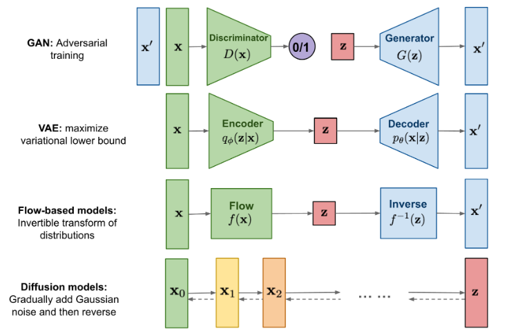

# A Summary of Generative Modeling Techniques

---

### Generative Adversarial Networks (GANs)

Exploring the Adversarial Approach

---

- **GANs** utilize two competing neural networks: a **Generator** to create synthetic data and a **Discriminator** to distinguish it from real data
- The networks are trained in a zero-sum game, progressively improving both generation and detection
- **Challenges**: Suffer from training instability, mode collapse (limited output variety), and difficult performance evaluation

---

### Variational Autoencoders (VAEs)

Understanding Probabilistic Encoding and Decoding

---

- **VAEs** learn a compressed, low-dimensional latent representation of data through an **Encoder** and **Decoder** architecture
- The **Encoder** maps input data to a probabilistic latent space
- The **Decoder** reconstructs the data by sampling from this latent space
- **Key Feature**: Enables smooth interpolation in the latent space but often produces less sharp samples compared to GANs

---

### Diffusion Models

A Deep Dive into Denoising-Based Generation

---

- **Diffusion Models** excel at high-fidelity generation by reversing a noise-injection process
- **Forward Process**: Gradually adds noise to data until it becomes a pure signal
- **Reverse Process**: A trained model progressively removes noise to generate a clean sample from a random signal
- **Pros**: Produces high-quality, diverse samples with stable training
- **Cons**: Generation is slow and computationally expensive due to the iterative denoising process

---

### Flow Matching

A Simulation-Free Approach for Training Continuous Normalizing Flows

---

- **Goal**: To train **Continuous Normalizing Flows (CNFs)**, which learn a transformation from a simple noise distribution to a complex data distribution, defined by a continuous-time vector field.
- **Flow Matching (FM)** proposes to directly regress a neural network to learn this target vector field, but the true target vector field is intractable to compute for the entire dataset.
- **Conditional Flow Matching (CFM)** is the paper's key contribution: a practical, simulation-free training method that overcomes this problem.
- **CFM** defines simpler probability paths and target vector fields that are *conditioned on individual data points* from the dataset, which are easy to compute.
- The key insight is that the gradients of the simple CFM objective are identical to the intractable FM objective, allowing the model to learn the correct overall flow.
- This approach can be extended to standard **conditional generation** by providing the vector field with extra context (e.g., class labels), enabling guided synthesis.
- **Pros**: Simulation-free training leads to efficiency and stability; allows for fast sampling with few steps; features a simple and direct regression objective.
- **Cons**: As a newer technique, best practices are still emerging; exact likelihood calculation can be intensive; performance may depend on the design of probability paths.

---

### Visual Overview of Architectures

A Comparative Chart of Generative Model Architectures

---

*A visual comparison of GAN, VAE, Flow-based, and Diffusion models.*

*Image Source: [Lilian Weng's Blog](https://lilianweng.github.io/posts/2021-07-11-diffusion-models/)*

---

