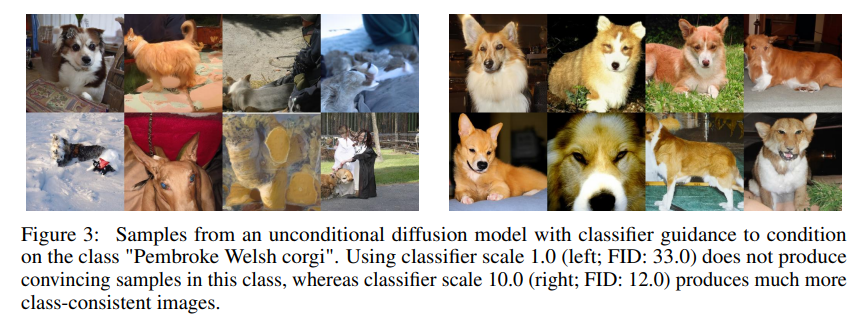
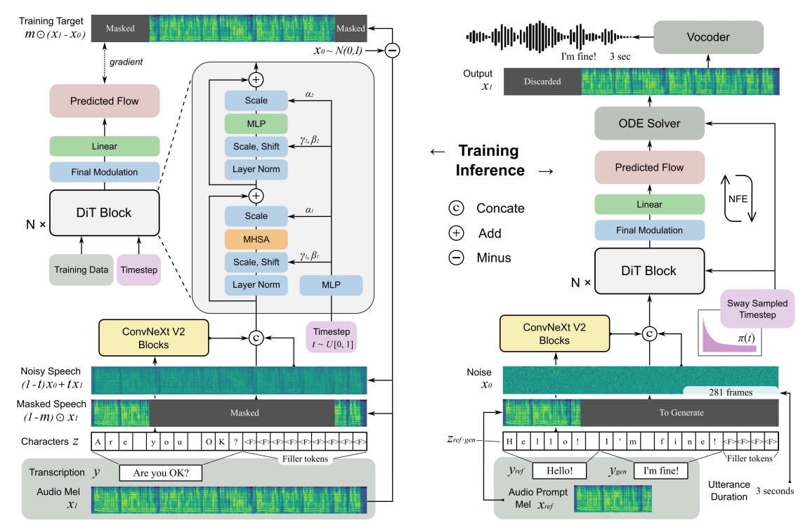

# F5-TTS

## Overview of F5-TTS

Overview of F5-TTS

---

- **Fully non-autoregressive TTS** built on **Flow Matching** with **Diffusion Transformer (DiT)**
- **Removes**: phoneme alignment, duration predictor, explicit text encoder
- **Text input**: characters padded with filler tokens to match acoustic sequence length
- **Text refinement**: ConvNeXt V2 front-end for easier text–speech alignment
- **Backbone**: DiT learns conditional velocity field; parallel generation, low NFEs

---

## Review of Conditional Flow Matching (CFM)

Conditional Flow Matching (CFM) essentials for TTS

---

- **Goal**: learn a time-dependent vector field $v_\theta(x, t)$ that transports a simple prior $x(0) \sim p_0$ to the target $x(1) \sim p_{\text{data}}$.
- **CFM with Optimal Transport (OT) paths**:
  - Interpolate along a straight line: $x_t = (1-t) x_0 + t x_1$
  - Training loss: $\mathcal{L}_{CFM}(\theta) = \mathbb{E}_{t, x_0, x_1} \, \| v_\theta(x_t, t) - (x_1 - x_0) \|^2 = \mathbb{E}_{t, x_0, x_1} \, \| v_\theta((1-t) x_0 + t x_1) - (x_1 - x_0) \|^2$.
- **Training procedure**:
  - sample $x_1$ from data, $x_0$ from the prior, and $t \sim \mathcal{U}(0,1)$
  - form $x_t = (1-t) x_0 + t x_1$
  - minimize $\mathcal{L}_{CFM}(\theta)$
- **Sampling (inference)**: integrate the ODE $\tfrac{dx_t}{dt} = v_\theta(x_t, t)$ from $t=0$ to $t=1$ with a suitable solver (e.g., Euler/Heun variants), typically with few NFEs.
- **Advantages for TTS**:
  - simulation-free training; straight-line OT paths simplify optimization
  - direct velocity learning enables efficient ODE solvers and parallel generation
  - strong fit for non-autoregressive TTS with flexible conditioning

---

## Classifier Guidance (CG)

Classifier Guidance (CG): Formal Overview and Mechanism

*Fig: Classifier Guidance mechanism. [Source](https://arxiv.org/pdf/2105.05233)*

---

### Motivation for Classifier Guidance

- Enhances conditional fidelity in generative models, ensuring outputs more closely match the specified condition (e.g., class label, text prompt).
- Addresses the issue where unconditional or weakly conditional models may generate samples that are plausible but do not strictly adhere to the desired condition.
- Provides a principled method to control the trade-off between sample quality (fidelity) and diversity.

### Mechanism

- **Components**:
  - *Generative Model*: A diffusion model trained to model the data distribution, typically without strong conditioning.
  - *Auxiliary Classifier*: A neural network trained to predict the target condition $y$ from noisy samples $x(t)$ at various noise levels $t$.
- **Guidance Procedure**:
    - This procedure is applied in DDIM (for more details about DDIM, see the [source](https://arxiv.org/pdf/2010.02502).)
    - **Sample Initialization**: Start with a sample $x_T$ from the prior (e.g., standard normal distribution).
    - **Iterative Update**: For each reverse step $t = T, T-1, \ldots, 1$:
      - Compute the model's prediction $\epsilon_\theta(x_t)$ for the current noisy sample $x_t$.
      - Compute the classifier gradient $\nabla_{x_t} \log p_\phi(y \mid x_t)$, which indicates how to adjust $x_t$ to increase the likelihood of the target condition $y$.
      - Form the guided noise estimate:
        $$
        \hat{\epsilon} = \epsilon_\theta(x_t) - \sqrt{1 - \bar{\alpha}_t} \, s \, \nabla_{x_t} \log p_\phi(y \mid x_t)
        $$
        where $s$ is the guidance scale and $\bar{\alpha}_t$ is the cumulative product of noise schedule coefficients.
      - Update the sample using the DDIM update rule:
        $$
        x_{t-1} = \sqrt{\bar{\alpha}_{t-1}} \left( \frac{x_t - \sqrt{1 - \bar{\alpha}_t} \, \hat{\epsilon}}{\sqrt{\bar{\alpha}_t}} \right) + \sqrt{1 - \bar{\alpha}_{t-1}} \, \hat{\epsilon}
        $$
      - About $\alpha_t$, check this [reference](https://arxiv.org/pdf/2006.11239).

- **Interpretation**:
  - The classifier gradient acts as an external force, steering the generative process towards regions of higher conditional likelihood.
  - The guidance scale $s$ allows explicit control over the strength of conditioning.

### Key Properties and Trade-offs

- **Fidelity vs. Diversity**:
  - Higher guidance weights $w$ increase conditional fidelity but may reduce sample diversity and introduce artifacts if the classifier is imperfect.
- **Classifier Training**:
  - The classifier must be trained to be robust to all noise levels $t$ encountered during sampling, typically via noise augmentation.
  - The classifier is trained independently from the generative model.
- **System Complexity**:
  - Requires an additional classifier network, increasing computational and implementation complexity.
- **Potential Artifacts**:
  - Inaccurate or biased classifiers can introduce artifacts or degrade sample quality, especially at high guidance strengths.
- **Challenges**:
  - Training a reliable classifier on noisy intermediate speech representations is particularly challenging, motivating the use of alternative approaches such as Classifier-Free Guidance (CFG).

---

## Classifier-Free Guidance (CFG)

Classifier-Free Guidance (CFG)

---

### Motivation

- **Addresses CG Limitations**: CFG overcomes key drawbacks of Classifier Guidance (CG) in conditional generative modeling.
- **No Extra Classifier Needed**: Removes the requirement for a separate auxiliary classifier network.
- **Simpler Architecture**: Streamlines the model design and lowers computational demands.
- **No Classifier Training Hassles**: Sidesteps the challenge of training a classifier robust to all noise levels.
- **Stable and Effective Guidance**: Delivers a more stable and effective guidance signal by relying on the generative model itself, rather than external classifier gradients.

### Training Method

CFG employs a unified training strategy for conditional and unconditional generation by modifying the conditioning mechanism during training:

- **Single Model Training**:
  - The model $\epsilon_\theta(x_t, c)$ is trained on pairs of data and conditioning information.
- **Condition Dropout**:
  - With a specified probability, the conditioning input $c$ (e.g., text embedding, class label) is replaced by a null token or empty embedding $\emptyset$.
- **Dual Learning Objective**:
  - The model learns to predict noise both with the condition present, $\epsilon_\theta(x_t, c)$, and with the condition absent, $\epsilon_\theta(x_t, \emptyset)$.
- **Unified Weight Sharing**:
  - Both conditional $p(x|c)$ and unconditional $p(x)$ distributions are modeled within a single set of parameters.

### Sampling Process

During inference, CFG combines conditional and unconditional predictions to control the strength of guidance:

- **Noise Estimate Computation**:
  - Compute the conditional noise estimate: $\epsilon_\theta(x_t, c)$.
  - Compute the unconditional noise estimate: $\epsilon_\theta(x_t, \emptyset)$.
- **Guided Estimate Formation**:
  - Combine the two estimates as follows:
    $$
    \tilde{\epsilon}_\theta(x_t, c) = \epsilon_\theta(x_t, \emptyset) + w \cdot (\epsilon_\theta(x_t, c) - \epsilon_\theta(x_t, \emptyset))
    $$
    - $\tilde{\epsilon}_\theta(x_t, c)$: final guided noise used for the sampling step.
    - $w$: guidance scale parameter.
  - The difference $(\epsilon_\theta(x_t, c) - \epsilon_\theta(x_t, \emptyset))$ serves as an implicit approximation of the classifier score gradient $\nabla_{x_t} \log p(c|x_t)$.
- **Guidance Scale Interpretation**:
  - $w = 0$: purely unconditional generation ($\tilde{\epsilon}_\theta = \epsilon_\theta(x_t, \emptyset)$).
  - $w = 1$: standard conditional generation ($\tilde{\epsilon}_\theta = \epsilon_\theta(x_t, c)$).
  - $w > 1$: amplified guidance, increasing fidelity to the condition $c$ at the potential expense of sample diversity.
- **Integration with Sampler**:
  - The guided estimate $\tilde{\epsilon}_\theta$ is used in the update rule of the chosen sampler (e.g., DDIM or Flow Matching) to advance the generative process.

---

## F5-TTS Model Architecture

Inputs, backbone, objective, vocoder, and performance

  

---

**F5-TTS**: Fully non-autoregressive TTS system using **Flow Matching (FM)** and a **Diffusion Transformer (DiT)** backbone. Designed for simplicity and efficiency—no duration models, text encoders, or phoneme alignment.

### Key Components

- **Text Preprocessing**: Pads input text with filler tokens to match target length; no complex encoder.
- **ConvNeXt V2 Frontend**: Refines text representation for better alignment with speech.
- **Diffusion Transformer (DiT)**: Learns conditional velocity field for FM; scalable and performant.
- **Flow Matching Training**: Simulation-free, continuous normalizing flow objective; enables efficient, high-quality generation with few function evaluations (NFEs).
- **Sway Sampling**: Inference-time schedule warping for improved performance/efficiency without retraining.

### Training Objective

- **Loss**: Mean squared error between predicted and ground-truth velocity.
- **Conditional Flow Matching Loss**:
  $$
  \mathcal{L}_{CFM}(\theta) = \mathbb{E}_{t, x_0, x_1, c} \| v_\theta(x_t, t, c) - (x_1 - x_0) \|^2
  $$
  - $x_1$: target speech
  - $x_0$: prior sample (e.g., Gaussian noise)
  - $c$: text condition
  - $t \sim U(0,1)$; $x_t = (1-t)x_0 + t x_1$
  - $v_\theta$: DiT-predicted velocity

### Classifier-Free Guidance (CFG)

- **Training**:
  - Mask the audio condition with probability $p$ uniformly sampled from $0.7$ to $1.0$.
  - Drop the masked audio condition with probability $p=0.3$.
  - Drop both the masked audio and text conditions together with probability $p=0.2$.
  - This enables both conditional and unconditional modeling.
- **Inference**: Combine conditional and unconditional predictions:
  $$
  \tilde{v}_\theta(x_t, t, c) = v_\theta(x_t, t, \emptyset) + w \cdot (v_\theta(x_t, t, c) - v_\theta(x_t, t, \emptyset))
  $$
  - $w$: guidance strength (0 = unconditional, 1 = standard, $>1$ = stronger guidance; paper suggests $w \approx 2$)

### Sampling Process

- **Noise Initialization**: Sample the initial latent $x_0$ from a uniform distribution.
- **Sway Sampling for Time Steps**:
  - Create a uniform array $u$ of $N$ time steps in $[0, 1]$.
  - Apply the sway sampling function to obtain a non-uniform time schedule:
    $$
    t_i = f_\mathrm{sway}(u_i; s) = u_i + s \cdot \left( \cos\left( \frac{\pi}{2} u_i \right) - 1 + u_i \right)
    $$
    where $s \in [-1, 1]$ controls the warping (paper suggests $s = -1$).
- **Euler Integration**:
  - For each consecutive pair $(t_i, t_{i+1})$ in the sway-sampled time array, update $x$ using the Euler method:
    $$
    x_{i+1} = x_i + (t_{i+1} - t_i) \cdot v_\theta(x_i, t_i, c)
    $$
    where $v_\theta$ is the model's predicted velocity.

---

## References

External references

---

- **F5-TTS**: [https://arxiv.org/pdf/2410.06885](https://arxiv.org/pdf/2410.06885)
- **GENERATIVE PRE-TRAINING FOR SPEECH WITH FLOW MATCHING**: [https://arxiv.org/pdf/2310.16338](https://arxiv.org/pdf/2310.16338)
- **[CG] Diffusion Models Beat GANs on Image Synthesis**: [https://arxiv.org/pdf/2105.05233](https://arxiv.org/pdf/2105.05233)
- **[DDIM] DENOISING DIFFUSION IMPLICIT MODELS**: [https://arxiv.org/pdf/2010.02502](https://arxiv.org/pdf/2010.02502)
- **[DDPM] Denoising Diffusion Probabilistic Models**: [https://arxiv.org/pdf/2006.11239](https://arxiv.org/pdf/2006.11239)
- **[CFG] CLASSIFIER-FREE DIFFUSION GUIDANCE**: [https://arxiv.org/pdf/2207.12598](https://arxiv.org/pdf/2207.12598)
---

